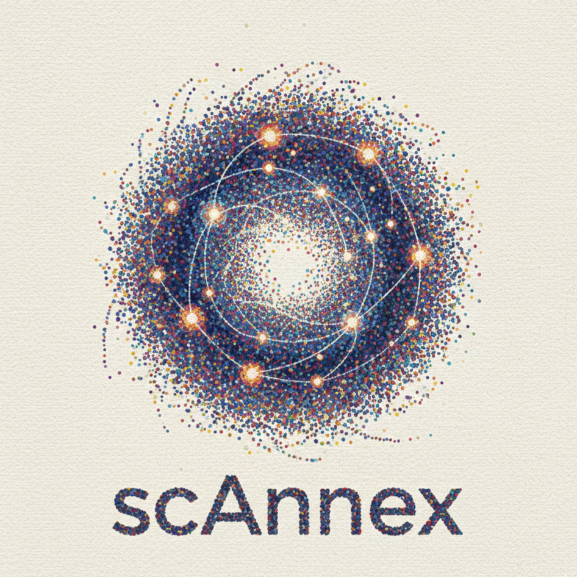

<div align="center">



# scAnnex

**Automated single-cell RNA-seq analysis.**  
From raw counts to insights.

[](https://www.nextflow.io/)
[](https://docs.conda.io/)
[](https://www.nextflow.io/docs/latest/wave.html)
[](https://www.docker.com/)
[](https://sylabs.io/docs/)

[Quick Start](#quick-start) •
[Documentation](#documentation) •
[Dashboard](#dashboard) •
[Examples](#examples)

</div>

---

## What it does

scAnnex automates the complete workflow for single-cell RNA-seq analysis:

- **Quality Control** — Adaptive filtering with quantile-based thresholds
- **Doublet Detection** — Scrublet integration for automated doublet removal
- **Normalization** — Log-normalization and highly variable gene selection
- **Batch Correction** — Harmony integration for multi-sample datasets
- **Clustering** — Multi-resolution Leiden clustering
- **Cell Annotation** — CellTypist integration with automatic model download
- **Interactive Dashboard** — Real-time exploration with R Shiny

<div align="center">
  
  <p><i>Interactive dashboard for real-time data exploration</i></p>
</div>

---

## Quick Start

### Installation

Install Nextflow:
```bash
curl -s https://get.nextflow.io | bash
sudo mv nextflow /usr/local/bin/
```

### Run the pipeline

Process your data in one command:

```bash
nextflow run main.nf \
  -profile wave \
  --input samplesheet.csv \
  --outdir results \
  --max_memory '8.GB'
```

**Samplesheet format** (`samplesheet.csv`):
```csv
sample_id,file_type,file_path,batch,condition
sample1,h5ad,data/sample1.h5ad,batch1,control
sample2,h5ad,data/sample2.h5ad,batch1,treated
```

### Launch the dashboard

```bash
cd dashboard
bash launch_dashboard.sh ../results
```

Access at: http://localhost:3838

---

## Profiles

Choose the right execution profile for your environment:

| Profile | Use Case | Command |
|---------|----------|---------|
| **wave** | Recommended • Builds containers on-demand | `-profile wave` |
| **conda** | Simple • Works everywhere | `-profile conda` |
| **docker** | Local machines | `-profile docker` |
| **singularity** | HPC clusters | `-profile singularity` |

**For laptops** with limited RAM:
```bash
nextflow run main.nf -profile wave --max_memory '8.GB'
```

**For HPC** with plenty of resources:
```bash
nextflow run main.nf -profile wave --max_memory '120.GB'
```

> Memory allocation adapts automatically. Processes use 60-75% of `--max_memory` to prevent failures.

---

## Parameters

### Essential

| Parameter | Description | Default |
|-----------|-------------|---------|
| `--input` | Samplesheet CSV path | *required* |
| `--outdir` | Output directory | `./results` |
| `--max_memory` | Maximum memory available | `128.GB` |

### Quality Control

| Parameter | Description | Default |
|-----------|-------------|---------|
| `--use_quantile_filtering` | Use quantile-based thresholds | `true` |
| `--feature_quantile_low` | Lower percentile for genes | `0.10` |
| `--feature_quantile_high` | Upper percentile for genes | `0.90` |
| `--max_mito_percent` | Max mitochondrial percentage | `20` |

### Processing

| Parameter | Description | Default |
|-----------|-------------|---------|
| `--run_doublet_detection` | Detect and remove doublets | `true` |
| `--run_integration` | Enable batch correction | `false` |
| `--batch_key` | Batch column name | `null` |
| `--run_auto_annotation` | Annotate cell types | `true` |
| `--celltypist_model` | CellTypist model | `Immune_All_Low.pkl` |

### Clustering

| Parameter | Description | Default |
|-----------|-------------|---------|
| `--clustering_resolutions` | Leiden resolutions | `0.1,0.3,0.5,0.7,0.9` |
| `--n_neighbors` | Number of neighbors for UMAP | `15` |
| `--n_pcs` | Principal components | `50` |

---

## Dashboard

The interactive dashboard provides real-time exploration of your results.

**Features:**
- Quality control metrics visualization
- Interactive UMAP plots with WebGL acceleration
- Gene expression overlay
- Cell type composition analysis
- Export-ready plots

**Launch:**
```bash
cd dashboard
bash launch_dashboard.sh ../results
```

The launcher handles environment setup automatically on first run (~5-10 min, one-time only).

**Requirements:**
- R 4.3+ with Shiny
- Python 3.10+ with scanpy, anndata

All dependencies installed automatically via conda.

---

## Output Structure

```
results/
├── unified_input/
│   └── sample_unified.h5ad          # Standardized input
├── qc/
│   ├── sample_qc.h5ad                # QC-filtered data
│   └── qc_results/
│       ├── qc_report.json            # QC metrics
│       ├── qc_before_violin.png      # Pre-filtering plots
│       └── cell_attrition_log.csv    # Filtering summary
├── doublet_detection/
│   ├── sample_doublets.h5ad          # Doublet scores
│   └── doublet_scores.csv
├── normalized/
│   └── sample_processed.h5ad         # Normalized + clustered
├── annotation/
│   ├── sample_annotated.h5ad         # Final annotated data
│   └── sample_celltypist.csv         # Cell type predictions
└── pipeline_info/
    ├── execution_report.html
    ├── execution_timeline.html
    └── pipeline_dag.html
```

---

## Examples

### Basic Analysis

Process a single sample with default QC:

```bash
nextflow run main.nf \
  -profile wave \
  --input samplesheet.csv \
  --outdir results \
  --max_memory '8.GB'
```

### Multi-sample with Batch Correction

Integrate multiple samples with Harmony:

```bash
nextflow run main.nf \
  -profile wave \
  --input samplesheet.csv \
  --outdir results \
  --run_integration \
  --batch_key batch \
  --max_memory '32.GB'
```

### HPC Execution

Run on SLURM cluster with Singularity:

```bash
nextflow run main.nf \
  -profile singularity \
  --input samplesheet.csv \
  --outdir results \
  --max_memory '120.GB' \
  -process.executor slurm \
  -process.queue normal
```

### Resume from Checkpoint

Continue a failed or interrupted run:

```bash
nextflow run main.nf \
  -profile wave \
  --input samplesheet.csv \
  --outdir results \
  -resume
```

---

## Documentation

- **[Getting Started](docs/GETTING_STARTED.md)** — Detailed installation and first run
- **[Execution Profiles](docs/EXECUTION_PROFILES.md)** — Profile comparison and troubleshooting
- **[Dashboard Usage](docs/DASHBOARD_USAGE.md)** — Interactive visualization guide
- **[Troubleshooting](docs/Troubleshooting.md)** — Common issues and solutions

---

## Requirements

**Nextflow:** ≥23.04.0  
**Container engine:** Docker, Singularity, or Podman  
**Conda:** (optional) For non-containerized execution

**Pipeline tested on:**
- Ubuntu 18.04+
- macOS 12+
- WSL2 (Windows)
- HPC clusters (SLURM, PBS)

---

## License

MIT License. See [LICENSE](LICENSE) for details.

---

## Citation

If you use scAnnex in your research, please cite:

```
scAnnex: Automated Nextflow pipeline for single-cell RNA-seq analysis
https://github.com/damouzo/scAnnex
```

---

<div align="center">
  <sub>Built with Nextflow • Powered by Scanpy</sub>
</div>
