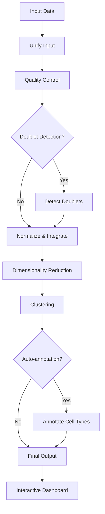

# scAnnex

> **Single-cell RNA-seq downstream analysis pipeline with interactive dashboard**

[](https://www.nextflow.io/)
[](https://www.docker.com/)
[](https://sylabs.io/docs/)

## Introduction

**scAnnex** is a comprehensive Nextflow pipeline for downstream analysis of single-cell RNA-seq data. It provides:

- 🔄 **Flexible input formats**: Support for H5AD, RDS (Seurat), and 10X MTX formats
- 🎯 **Quality control**: Automated QC with filtering and visualization
- 🔍 **Doublet detection**: Using Scrublet
- 📊 **Normalization**: Log-normalization with optional batch correction (Harmony, Scanorama, BBKNN)
- 🧬 **Dimensionality reduction**: PCA and UMAP
- 🎨 **Clustering**: Leiden/Louvain with multiple resolutions
- 🏷️ **Auto-annotation**: Optional cell type annotation based on marker lists
- 📈 **Interactive dashboard**: Shiny app for exploration and manual curation

## Pipeline overview



## Quick Start

1. Install [Nextflow](https://www.nextflow.io/docs/latest/getstarted.html#installation) (`>=23.04.0`)

2. Install one of the following: [Docker](https://docs.docker.com/engine/installation/), [Singularity](https://www.sylabs.io/guides/3.0/user-guide/), [Podman](https://podman.io/), [Conda](https://conda.io/miniconda.html)

3. Run the pipeline with test data:

```bash
nextflow run scannex/main.nf -profile test,docker --outdir results
```

## Usage

### Basic usage

```bash
nextflow run scannex/main.nf \\
    --input sample_data.h5ad \\
    --input_type h5ad \\
    --outdir results \\
    -profile docker
```

### With batch correction

```bash
nextflow run scannex/main.nf \\
    --input sample_data.h5ad \\
    --run_integration \\
    --batch_key batch \\
    --integration_method harmony \\
    --outdir results \\
    -profile docker
```

### With auto-annotation

```bash
nextflow run scannex/main.nf \\
    --input sample_data.h5ad \\
    --run_auto_annotation \\
    --marker_list markers.csv \\
    --outdir results \\
    -profile docker
```

## Parameters

### Input/Output

| Parameter | Type | Default | Description |
|-----------|------|---------|-------------|
| `--input` | string | **required** | Path to input file (H5AD, RDS, or MTX directory) |
| `--input_type` | string | `h5ad` | Input file type: `h5ad`, `rds`, or `mtx` |
| `--outdir` | string | `./results` | Output directory |

### Quality Control

| Parameter | Type | Default | Description |
|-----------|------|---------|-------------|
| `--min_genes` | integer | `200` | Minimum genes per cell |
| `--min_cells` | integer | `3` | Minimum cells per gene |
| `--max_genes` | integer | `null` | Maximum genes per cell (optional) |
| `--max_counts` | integer | `null` | Maximum counts per cell (optional) |
| `--max_mito_percent` | number | `20` | Maximum mitochondrial percentage |

### Doublet Detection

| Parameter | Type | Default | Description |
|-----------|------|---------|-------------|
| `--run_doublet_detection` | boolean | `true` | Run doublet detection |
| `--expected_doublet_rate` | number | `0.05` | Expected doublet rate |

### Normalization & Integration

| Parameter | Type | Default | Description |
|-----------|------|---------|-------------|
| `--normalization_method` | string | `log` | Normalization method: `log` or `scran` |
| `--target_sum` | integer | `10000` | Target sum for normalization |
| `--run_integration` | boolean | `false` | Run batch integration |
| `--batch_key` | string | `null` | Column name for batch information |
| `--integration_method` | string | `harmony` | Integration method: `harmony`, `scanorama`, or `bbknn` |

### Dimensionality Reduction & Clustering

| Parameter | Type | Default | Description |
|-----------|------|---------|-------------|
| `--n_pcs` | integer | `50` | Number of principal components |
| `--n_neighbors` | integer | `15` | Number of neighbors for UMAP |
| `--umap_min_dist` | number | `0.5` | Minimum distance for UMAP |
| `--clustering_method` | string | `leiden` | Clustering algorithm: `leiden` or `louvain` |
| `--clustering_resolutions` | string | `0.4,0.8,1.0` | Comma-separated clustering resolutions |

### Annotation

| Parameter | Type | Default | Description |
|-----------|------|---------|-------------|
| `--run_auto_annotation` | boolean | `false` | Run automatic annotation |
| `--marker_list` | string | `null` | Path to marker gene list CSV |

## Output

```
results/
├── unified_input/          # Unified H5AD format
├── qc/                     # QC metrics and plots
│   ├── plots/
│   └── qc_metrics.csv
├── doublet_detection/      # Doublet scores and plots
│   ├── plots/
│   └── doublet_scores.csv
├── normalized/             # Normalized and integrated data
├── dimensionality_reduction/  # PCA, UMAP, clustering
│   ├── plots/
│   └── sample_processed.h5ad
├── annotation/             # Cell type annotations
│   ├── plots/
│   └── annotation_summary.csv
└── pipeline_info/          # Execution reports
```

## Interactive Dashboard

Launch the Shiny dashboard to explore results:

```R
# In R console
library(shiny)
runApp("scannex/dashboard")
```

The dashboard provides:
- QC overview with interactive plots
- UMAP visualization with cluster coloring
- Gene expression search
- Manual cluster annotation/renaming
- Export annotated data

## Credits

scAnnex was developed by [Your Name/Organization].

### Software used

- [Nextflow](https://www.nextflow.io/)
- [Scanpy](https://scanpy.readthedocs.io/)
- [Scrublet](https://github.com/swolock/scrublet)
- [Harmony](https://github.com/immunogenomics/harmony)
- [Shiny](https://shiny.rstudio.com/)

## License

This pipeline is licensed under the MIT License.
