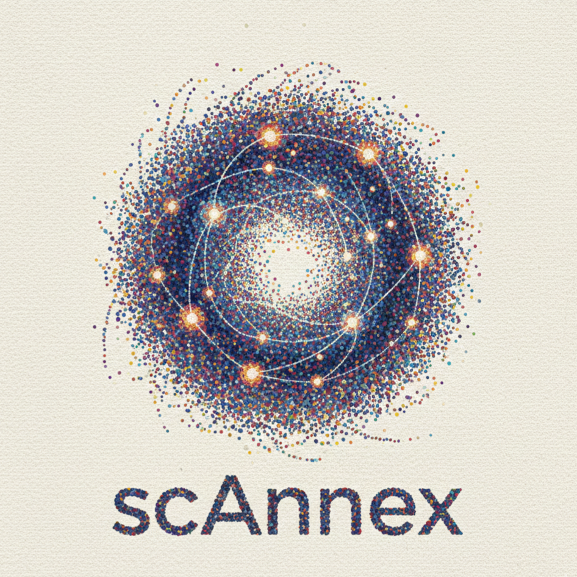
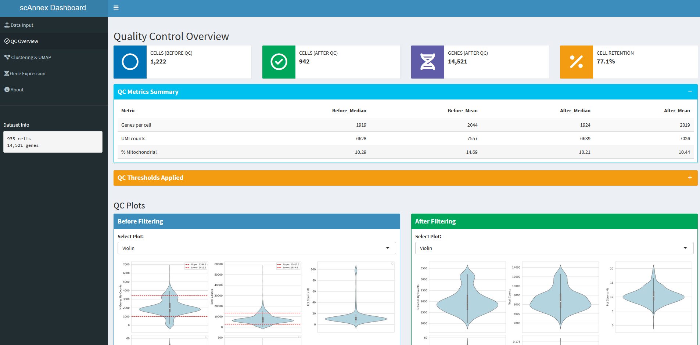
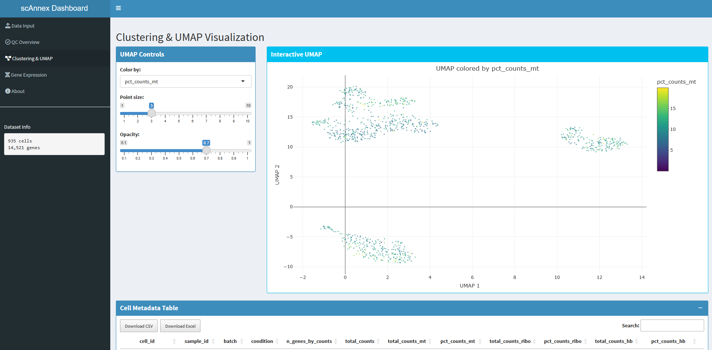
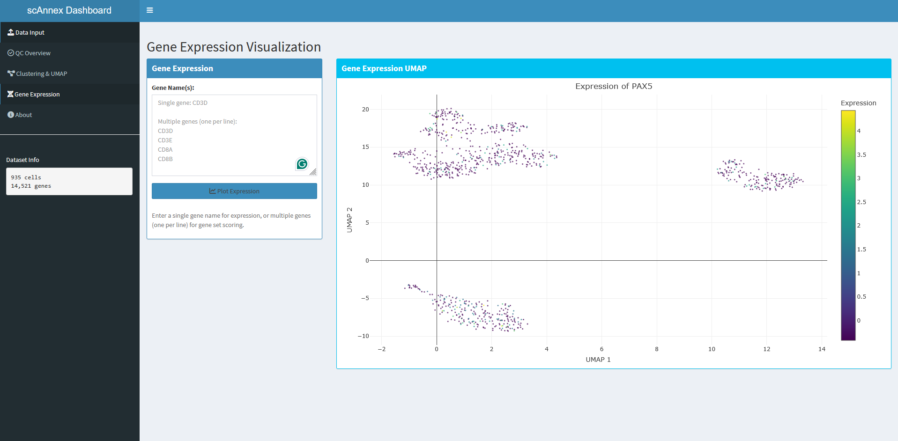
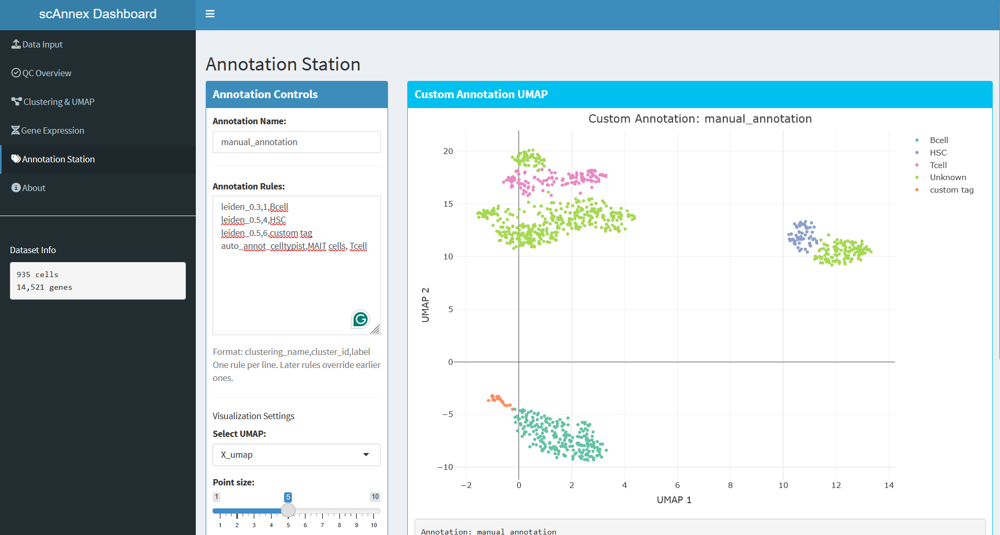

<div align="center">

<table>
<tr>
<td width="300" align="center">

</td>
<td align="center">

## **scAnnex**
<sub><span style="color:red">**Currently under active development**</span></sub>

**Automated scRNA-seq analysis.**  
From raw counts to insights.

[](https://www.nextflow.io/)
[](https://docs.conda.io/)
[](https://sylabs.io/docs/)

[Quick Start](#quick-start) •
[Documentation](#documentation) •
[Dashboard](#dashboard) •
[Examples](#examples)

</td>
</tr>
</table>

</div>

---

## Demo

*Complete walkthrough: QC metrics, clustering, gene expression, and custom annotations.*

**<a href="https://github.com/damouzo/scAnnex/releases/tag/v0.2.0" target="_blank">▶️ Watch Demo Video</a>**


---

## What it does

scAnnex automates the complete workflow for single-cell RNA-seq analysis:

- **Nextflow scRNA Analaysis Pipeline** — End-to-end pipeline in nextflow dsl2
- **Interactive Dashboard** — Real-time exploration with R Shiny
- **Quality Control** — Adaptive filtering with quantile-based thresholds
- **Doublet Detection** — Scrublet integration for automated doublet removal
- **Normalization** — Log-normalization and highly variable gene selection
- **Batch Correction** — Harmony integration for multi-sample datasets
- **Clustering** — Multi-resolution Leiden clustering
- **Cell Annotation** — CellTypist integration with automatic model download
- **Annotation Station** — Define cell types your way with rule-based annotation
- **Differential Gene Expresion** — Multiple-contrast analysis through wilconxon


## Quick Start

### Test with Demo Data

```bash
# 10x MTX format with Singularity (recommended for HPC)
nextflow run main.nf --input data_demo/10xMTX/samplesheet.csv --outdir results -profile singularity

# Or with conda (works everywhere)
nextflow run main.nf --input data_demo/10xMTX/samplesheet.csv --outdir results -profile conda
```

### Run with Your Data

```bash
nextflow run main.nf \
  -profile singularity \
  --input samplesheet.csv \
  --outdir results \
  --max_memory '8.GB'
```

**Samplesheet format** (`samplesheet.csv`):
```csv
sample_id,file_type,file_path,batch,condition
sample1,h5ad,data/sample1.h5ad,batch1,control
sample2,h5ad,data/sample2.h5ad,batch1,treated
```

### Launch the dashboard

```bash
# 1. One-time setup (installs everything you need)
cd dashboard
./setup_dashboard.sh

# 2. Launch dashboard
./launch_dashboard.sh
```

---

## Profiles

Choose the right execution profile for your environment:

| Profile | Use Case | Command |
|---------|----------|---------|
| **singularity** | HPC clusters (recommended) | `-profile singularity` |
| **conda** | Works everywhere (fallback) | `-profile conda` |
| **apocrita** | QMUL HPC with Singularity | `-profile apocrita,singularity` |
| **slurm** | Generic SLURM HPC | `-profile slurm,singularity` |


> Memory allocation adapts automatically. Processes use 60-75% of `--max_memory` to prevent failures.

---

## Parameters

### Essential

| Parameter | Description | Default |
|-----------|-------------|---------|
| `--input` | Samplesheet CSV path | *required* |
| `--outdir` | Output directory | `./results` |
| `--max_memory` | Maximum memory available | `128.GB` |

### Quality Control

| Parameter | Description | Default |
|-----------|-------------|---------|
| `--use_quantile_filtering` | Use quantile-based thresholds | `true` |
| `--feature_quantile_low` | Lower percentile for genes | `0.10` |
| `--feature_quantile_high` | Upper percentile for genes | `0.90` |
| `--max_mito_percent` | Max mitochondrial percentage | `20` |

### Processing

| Parameter | Description | Default |
|-----------|-------------|---------|
| `--run_doublet_detection` | Detect and remove doublets | `true` |
| `--run_integration` | Enable batch correction | `false` |
| `--batch_key` | Batch column name | `null` |
| `--run_auto_annotation` | Annotate cell types | `true` |
| `--celltypist_model` | CellTypist model | `Immune_All_Low.pkl` |

### Clustering

| Parameter | Description | Default |
|-----------|-------------|---------|
| `--clustering_resolutions` | Leiden resolutions | `0.1,0.3,0.5,0.7,0.9` |
| `--n_neighbors` | Number of neighbors for UMAP | `15` |
| `--n_pcs` | Principal components | `50` |

---

# Dashboard

Explore your data in real time. No coding required.

**Quality Control**
- Visualize metrics across all samples
- Identify filtering thresholds
- Track cell attrition



**Clustering & UMAP**
- Interactive scatter plots with WebGL
- Color by any metadata or clustering
- Zoom, pan, export



**Gene Expression**
- Search any gene
- Overlay expression on UMAP
- See distribution instantly



**Annotation Station**
- Define cell types with simple rules
- Combine clustering and auto-annotations
- Preview changes in real time
- Save annotations directly to H5AD



---

## Examples

### Basic Analysis

Process a single sample with default QC:

```bash
nextflow run main.nf \
  -profile wave \
  --input samplesheet.csv \
  --outdir results \
  --max_memory '8.GB'
```

### Multi-sample with Batch Correction

Integrate multiple samples with Harmony:

```bash
nextflow run main.nf  -profile apocrita,singularity   --input data_demo/MultiSample/H5AD/samplesheet.csv  --outdir results_dge   --run_integration   --batch_key batch   --calculate_integration_metrics   --run_dge   --contrasts_file data_demo/MultiSample/H5AD/contrasts_example.csv
```

### HPC Execution

Run on SLURM cluster with Singularity:

```bash
# Generic SLURM cluster
nextflow run main.nf \
  -profile slurm,singularity \
  --input samplesheet.csv \
  --outdir results \
  --max_memory '120.GB' \
  --slurm_queue normal \
  --slurm_account myproject

# QMUL Apocrita cluster (work-dir automatically set to scratch)
nextflow run main.nf \
  -profile apocrita,singularity \
  --input /gpfs/scratch/$USER/data/samplesheet.csv \
  --outdir /data/home/$USER/scannex_results  
```

---

## License

MIT License. See [LICENSE](LICENSE) for details.


## Citation


```
scAnnex: Automated Nextflow pipeline for single-cell RNA-seq analysis. https://github.com/damouzo/scAnnex
```


